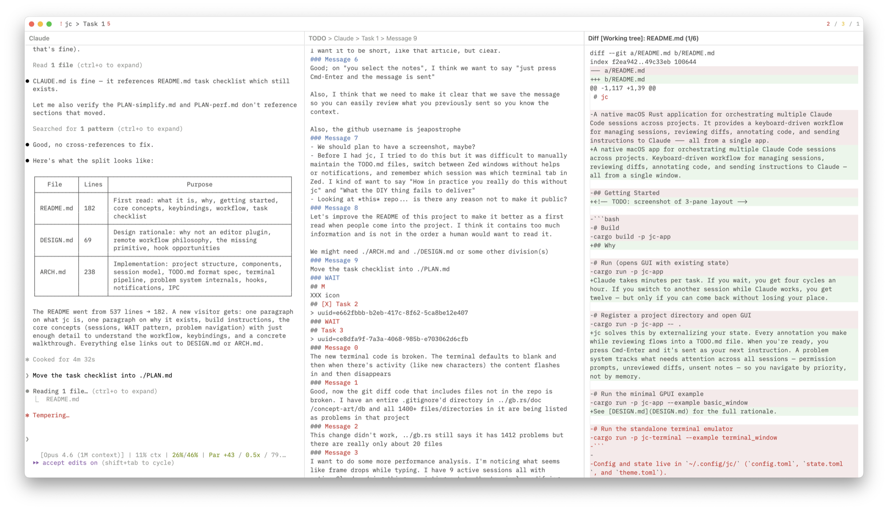

<p align="center">
  
</p>

<h1 align="center">jc</h1>

<p align="center">
  Orchestrate multiple Claude Code sessions across projects.<br>
  Review diffs, annotate code, send instructions — all from one window.
</p>

<p align="center">
  <a href="https://github.com/jeapostrophe/jc/actions/workflows/ci.yml"></a>
  <a href="LICENSE"></a>
  
  
</p>

<p align="center">
  <a href="#why">Why</a> · <a href="#getting-started">Getting Started</a> · <a href="#keybindings">Keybindings</a> · <a href="DESIGN.md">Design</a> · <a href="ARCH.md">Architecture</a>
</p>



## Why

Claude takes minutes per task. If you wait, you get four cycles an hour. If you switch to another session while Claude works, you get twelve — but only if you can come back without losing your place.

jc solves this by externalizing your state. Every annotation you make while reviewing flows into a TODO.md file. When you're ready, you press Cmd-Enter and it's sent as your next instruction. A problem system tracks what needs attention across all sessions — permission prompts, unreviewed diffs, unsent notes — so you navigate by priority, not by memory.

See [DESIGN.md](DESIGN.md) for the full rationale.

## Getting Started

```bash
# Build and run as macOS .app bundle
./make.sh

# Or run directly via cargo
cargo run -p jc-app

# Register a project directory
cargo run -p jc-app -- .
```

Config and state live in `~/.config/jc/` (`config.toml`, `state.toml`, `theme.toml`).

## Core Concepts

### Projects and Sessions

A **project** is a code repository registered with jc. Each project has one or more **sessions** — ongoing Claude Code conversations. Sessions are defined in the project's TODO.md:

```markdown
# Claude
## Refactor auth module
> uuid=abc123-def456-...
### Message 0
first instruction sent to claude
### Message 1
second instruction
### WAIT
Notes for next message go here.
```

The `### WAIT` marker separates what you've sent from what you're drafting. Annotations from any view (diff, terminal, code) accumulate below WAIT. When you send (Cmd-Enter), the notes become a numbered message and WAIT moves below it — so you always have a full history of what you asked.

Sessions are resumed automatically on startup via `claude --resume <uuid>`. New sessions get their UUID from Claude Code's hook system. `/clear` is handled transparently.

### Problem Navigation

The app tracks **problems** — things that need your attention:

| Priority | Examples | Meaning |
|---|---|---|
| L0 (urgent) | Permission prompt, API error | Claude is blocked |
| L1 (review) | Unreviewed diffs, terminal bell, script errors | Work to review |
| L2 (send) | Unsent notes below WAIT | Ready to send next instruction |
| L3 (idle) | Session finished, nothing queued | Start new work |

**Cmd-;** cycles through problems in priority order across all sessions. You don't pick a session — you pick the next problem. Permission prompts in other projects surface immediately.

See [ARCH.md](ARCH.md) for the full problem system internals.

## Views

The window has **1, 2, or 3 panes** (Cmd-1/2/3). Any view can go in any pane via Cmd-O.

| View | Description |
|---|---|
| **Claude Terminal** | Claude Code CLI in an embedded terminal. Notifications on stop/permission. |
| **General Terminal** | Separate shell per session for running tests, inspecting output. |
| **TODO Editor** | Markdown editor for session notes. Drafting area below WAIT, message history above. |
| **Git Diff** | Working tree diff with file-by-file review (Cmd-R to mark reviewed). |
| **Code Viewer** | Syntax-highlighted source with tree-sitter outline navigation. |
| **Global TODO** | Read-only view of `~/.claude/TODO.md`. |

Per-session pane layouts are saved and restored on session switch.

## Keybindings

Press **Cmd-?** for the in-app overlay.

### Global

| Key | Action |
|---|---|
| Cmd-1 / 2 / 3 | Set pane layout |
| Cmd-[ / ] | Focus previous / next pane |
| Cmd-O | Open picker (pane views + files) |
| Cmd-Shift-O | Drill-down picker (symbols / modified files / headings) |
| Cmd-P | Session picker (all projects) |
| Cmd-Shift-P | Project actions |
| Cmd-F | Search lines in current editor |
| Cmd-K | Comment — annotate selection, appended below WAIT |
| Cmd-Shift-K | Snippet picker (`~/.claude/jc.md`) |
| Cmd-S | Save file |
| Cmd-Enter | Send notes to Claude terminal |
| Cmd-Shift-C | Copy Claude's reply (`/copy` → clipboard → `.jc/replies/`) |
| Cmd-; | Next problem |
| Cmd-. | Jump to WAIT |
| Cmd-` | Rotate to next project |
| Cmd-D | Toggle Code ↔ Diff for current file |
| Cmd-Shift-E | Open in external editor (Zed) |
| Cmd-Alt-↑/↓ | Scroll other pane |
| Cmd-? | Keybinding help |

### View-Specific

| Key | Action | View |
|---|---|---|
| Cmd-R | Reload from disk | Code |
| Cmd-R | Mark file reviewed | Diff |
| Cmd-C / Cmd-V | Copy / Paste | Terminal |
| Cmd-= / - / 0 | Font size +/-/reset | Terminal |

### Picker

| Key | Action |
|---|---|
| Enter | Confirm |
| Escape | Cancel |
| ↓ / Ctrl-N | Next |
| ↑ / Ctrl-P | Previous |
| Cmd-Shift-Backspace | Disable session |

## Workflow

### Review → Annotate → Send

1. Claude finishes. Desktop notification fires.
2. **Cmd-;** jumps to the most urgent problem.
3. Review the diff (Cmd-D). Highlight a region, **Cmd-K**, type a note → it appears below WAIT.
4. Check the terminal output. **Cmd-K** on selected text → appended below WAIT.
5. **Cmd-R** to mark files reviewed.
6. Open the TODO editor. Review accumulated notes. **Cmd-Enter** to send.
7. Switch to another session (Cmd-P) or wait.

### Navigate Code

1. **Cmd-O** → fuzzy file search.
2. **Cmd-Shift-O** → tree-sitter symbol outline.
3. **Cmd-K** to annotate. **Cmd-Shift-E** to open in Zed.

### Manage Sessions

1. `jc .` from a repo to register a project.
2. **Cmd-P** to switch sessions across all projects. Problem counts shown inline.
3. New sessions get UUIDs automatically via hooks. `/clear` updates the UUID transparently.

## Contributing

PRs welcome. Preferably have your Claude open one against mine — I don't accept human-authored code.

## Further Reading

- [Don't Wait for Claude](https://jeapostrophe.github.io/tech/jc-workflow/) — Article explaining the workflow philosophy behind jc

- [PLAN.md](PLAN.md) — Task checklist
- [DESIGN.md](DESIGN.md) — Design principles, why not an editor plugin, remote workflow philosophy
- [ARCH.md](ARCH.md) — Implementation details: session lifecycle, terminal pipeline, problem system, hooks, TODO.md format

## Star History

<a href="https://star-history.com/#jeapostrophe/jc&Date">
  <picture>
    <source media="(prefers-color-scheme: dark)" srcset="https://api.star-history.com/svg?repos=jeapostrophe/jc&type=Date&theme=dark" />
    <source media="(prefers-color-scheme: light)" srcset="https://api.star-history.com/svg?repos=jeapostrophe/jc&type=Date" />
    
  </picture>
</a>
