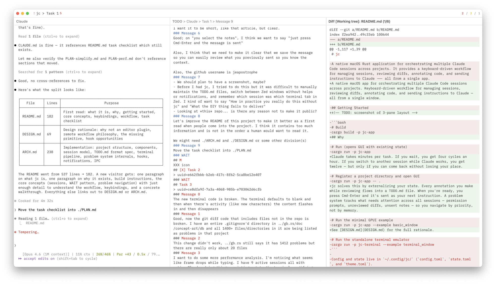

<p align="center">
  
</p>

<h1 align="center">jc</h1>

<p align="center">
  Orchestrate multiple Claude Code sessions across projects.<br>
  Draft, send, and switch — all from one window.
</p>

<p align="center">
  <a href="https://github.com/jeapostrophe/jc/actions/workflows/ci.yml"></a>
  <a href="LICENSE"></a>
  
  
</p>

<p align="center">
  <a href="#why">Why</a> · <a href="#getting-started">Getting Started</a> · <a href="#keybindings">Keybindings</a> · <a href="DESIGN.md">Design</a> · <a href="ARCH.md">Architecture</a>
</p>



## Why

Claude takes minutes per task. If you wait, you get four cycles an hour. If you switch to another session while Claude works, you get twelve — but only if you can come back without losing your place.

jc keeps your place outside your head. Each session's notes live in the project's TODO.md, under a `### WAIT` marker: you type the next instruction there whenever you think of it, and Cmd-Enter sends it and files it into the message log. Coming back to a session means reading what you already wrote, not reconstructing it.

Switching is cheap. Cmd-P lists every session in every project; each session keeps its own pane layout, cursor position, and terminal scrollback, restored on switch-back. A red `*` marks the sessions whose Claude terminal has printed something since you last had it on screen, so the picker tells you where the work moved while you were elsewhere. Desktop notifications stay out of the way — only a blocked session (permission prompt, API error) interrupts you, and only when jc isn't the front app.

See [DESIGN.md](DESIGN.md) for the full rationale.

## Getting Started

```bash
# Build and run as macOS .app bundle
./make.sh

# Or run directly via cargo
cargo run -p jc-app

# Register a project directory
cargo run -p jc-app -- .
```

Config and state live in `~/.config/jc/` (`config.toml`, `state.toml`, `theme.toml`).

## Core Concepts

### Projects and Sessions

A **project** is a code repository registered with jc. Each project has one or more **sessions** — ongoing Claude Code conversations. Sessions are defined in the project's TODO.md:

```markdown
# Claude
## Refactor auth module
> uuid=abc123-def456-...
### Message 0
first instruction sent to claude
### Message 1
second instruction
### WAIT
Notes for next message go here.
```

The `### WAIT` marker separates what you've sent from what you're drafting. Everything below WAIT is draft text — jc never treats it as log, even if it contains a quoted `### Message N` heading. When you send (Cmd-Enter), the draft becomes a numbered message and WAIT moves below it — so you have the recent history of what you asked.

The log is bounded: each send keeps the 25 most recent messages of that session and drops the rest, so a long-running session settles into a sliding window (`### Message 76` through `### Message 100`). jc applies the same bound to every session when it starts, so sessions you have not touched in a while get collected too; the first time it shortens a file it leaves a `TODO.md.bak` beside it.

One exception: truncation stops at a message still waiting on a `@jc(...)` scheduled send, so it can never cancel one. That session's log stays as long as it needs to until the send fires. Numbers are never reused, so a message keeps the number it was sent under. jc never sends TODO.md to Claude — messages are delivered to the session terminal and Claude resumes from its own transcript — so dropping old entries costs it no context.

jc mints the session UUID itself. A new session launches `claude --session-id <uuid>` under a freshly generated v4 UUID that is written to TODO.md at the same moment; existing sessions are resumed on startup with `claude --resume <uuid>`. If Claude has since garbage-collected a session's transcript, jc relaunches it with `--session-id` under the same UUID instead — you lose the conversation, but the heading, its message log, and its WAIT notes stay exactly where they were. `/clear` is handled transparently — the UUID in TODO.md is rewritten in place, with no terminal relaunch.

Per-session metadata lives on `> ` lines under the heading. `> uuid=` and `> last=` are managed by jc; add `> dangerous` by hand to spawn that session's `claude` with `--dangerously-skip-permissions` (takes effect on next spawn). See `ARCH.md` for the full list.

The `> uuid=` line, not the heading text, is what identifies a session — everything jc writes into TODO.md is addressed by it. Rename a heading to whatever you like, and give two headings the same name if that is what you want; sends and scheduled deliveries still land on the right one.

### Session Activity

The Cmd-P session picker marks each session with a single character:

| Marker | Meaning |
|---|---|
| red `*` | This session's Claude terminal has printed output since you last had it on screen |
| green `>` | The session you're on now |
| yellow `~` | In TODO.md but not running — pick it to adopt |
| grey `~` | Disabled (`[D]`) |
| blue `+` | A registered project with no sessions yet |

Sessions sort activity-first, then by recency; the session you're on sorts last, since you're already there. The marker clears when you switch away from a session, so it always means "since you last had it on screen", and the session you're currently on never shows one.

## Views

The window has **1, 2, or 3 panes** (Cmd-1/2/3). Any of the five views can go in any pane via Cmd-O.

| View | Description |
|---|---|
| **Claude Terminal** | Claude Code CLI in an embedded terminal. |
| **General Terminal** | Separate shell per session for running tests, inspecting output. |
| **Code Viewer** | Syntax-highlighted source with tree-sitter outline navigation. |
| **TODO Editor** | Markdown editor for session notes. Drafting area below WAIT, message history above. |
| **Global TODO** | View of `~/.claude/TODO.md`. |

Per-session pane layouts are saved and restored on session switch.

## Keybindings

Press **Cmd-?** for the in-app overlay.

### Global

| Key | Action |
|---|---|
| Cmd-1 / 2 / 3 | Set pane layout |
| Cmd-[ / ] | Focus previous / next pane |
| Cmd-O | Open picker (pane views + project files) |
| Cmd-Shift-O | Drill-down picker (symbols / TODO headings) |
| Cmd-P | Session picker (all projects) |
| Cmd-Shift-P | Project actions |
| Cmd-F | Search lines in current editor |
| Cmd-S | Save file |
| Cmd-Enter | Send draft below WAIT to the Claude terminal |
| Cmd-. | Jump to WAIT |
| Cmd-` | Next session (round-robin across all projects) |
| Cmd-Alt-↑/↓ | Scroll other pane by lines |
| Cmd-Alt-PageUp/PageDown | Scroll other pane by pages |
| Cmd-? | Keybinding help |
| Cmd-W / Cmd-M / Cmd-Q | Close window / minimize / quit |

### View-Specific

| Key | Action | View |
|---|---|---|
| Cmd-R | Reload from disk | Code |
| Cmd-C / Cmd-V | Copy / Paste | Terminal |
| Cmd-= / - / 0 | Font size +/-/reset | Terminal |

### Picker

| Key | Action |
|---|---|
| Enter | Confirm |
| Escape / Ctrl-C | Cancel |
| ↓ / Ctrl-N | Next |
| ↑ / Ctrl-P | Previous |
| PageDown / PageUp | Move 10 items |
| Cmd-Shift-Backspace | Toggle session disabled (session picker) |

## Workflow

### Draft → Send → Switch

1. **Cmd-.** jumps to the WAIT marker in the TODO editor, creating it if the session doesn't have one.
2. Type the next instruction there. It's a plain Markdown buffer — write it over several sittings if you like, while Claude works on the last one.
3. **Cmd-Enter** sends the draft to the Claude terminal, files it as `### Message N`, and stamps `> last=`.
4. **Cmd-P** to move to another session while that one runs. Your panes, cursor, and terminal scrollback come back when you return.
5. Sessions that printed something while you were away carry a red `*` in the picker.

### Navigate Code

1. **Cmd-O** → fuzzy search over the project's git-tracked and untracked files (`M` = modified, `R` = recently opened), or jump straight to one of the five pane views.
2. **Cmd-Shift-O** → tree-sitter symbol outline for the focused Code pane, or the heading outline for a TODO pane.
3. **Cmd-F** → fuzzy line search within the focused editor.
4. Edits made outside jc are picked up automatically; if you have unsaved edits, jc three-way merges them and only asks when the merge conflicts.

### Manage Sessions

1. `jc .` from a repo to register a project. A second `jc .` routes to the running instance over the IPC socket.
2. **Cmd-Shift-P** lists what you can start in the current project: dormant TODO.md sessions (`*`), a brand-new session (`+`), and Claude transcripts on disk that TODO.md doesn't know about (`~`).
3. **Cmd-P** switches between running sessions across every project, and adopts dormant ones.
4. **Cmd-Shift-Backspace** in the session picker toggles `[D]` on a session's heading, so it stays in TODO.md but no longer starts with jc.

## Contributing

PRs welcome. Preferably have your Claude open one against mine — I don't accept human-authored code.

## Further Reading

- [Don't Wait for Claude](https://jeapostrophe.github.io/tech/jc-workflow/) — Article explaining the workflow philosophy behind jc

- [PLAN.md](PLAN.md) — Task checklist
- [DESIGN.md](DESIGN.md) — Design principles, why not an editor plugin, remote workflow philosophy
- [ARCH.md](ARCH.md) — Implementation details: session lifecycle, terminal pipeline, hooks, TODO.md format

## Star History

<a href="https://star-history.com/#jeapostrophe/jc&Date">
  <picture>
    <source media="(prefers-color-scheme: dark)" srcset="https://api.star-history.com/svg?repos=jeapostrophe/jc&type=Date&theme=dark" />
    <source media="(prefers-color-scheme: light)" srcset="https://api.star-history.com/svg?repos=jeapostrophe/jc&type=Date" />
    
  </picture>
</a>
